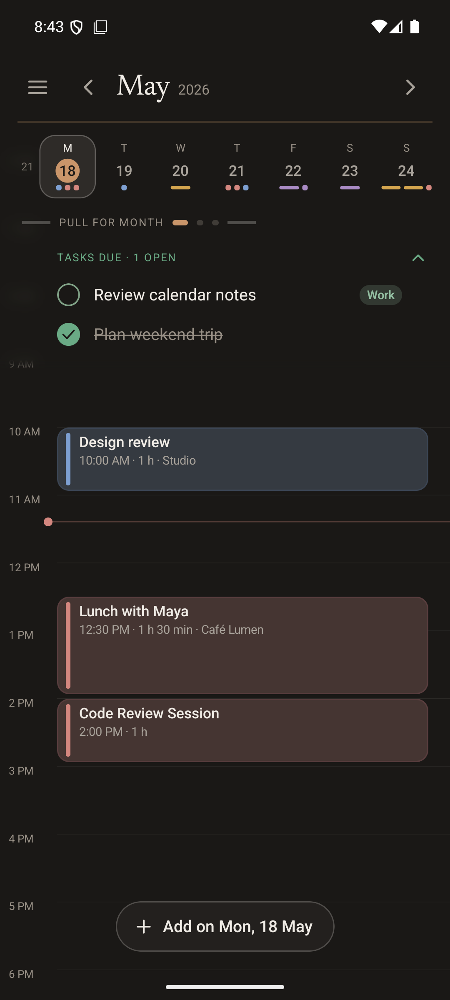
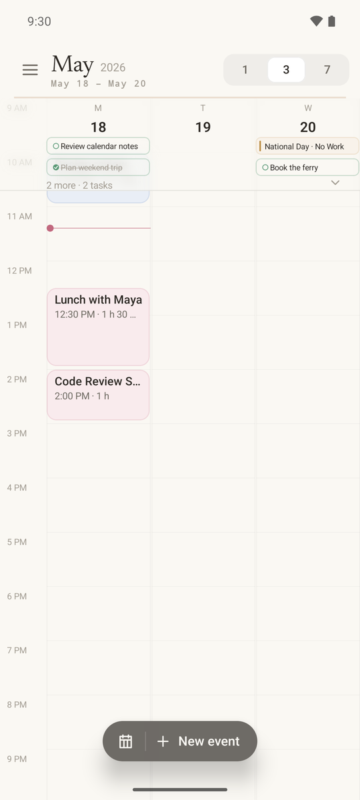
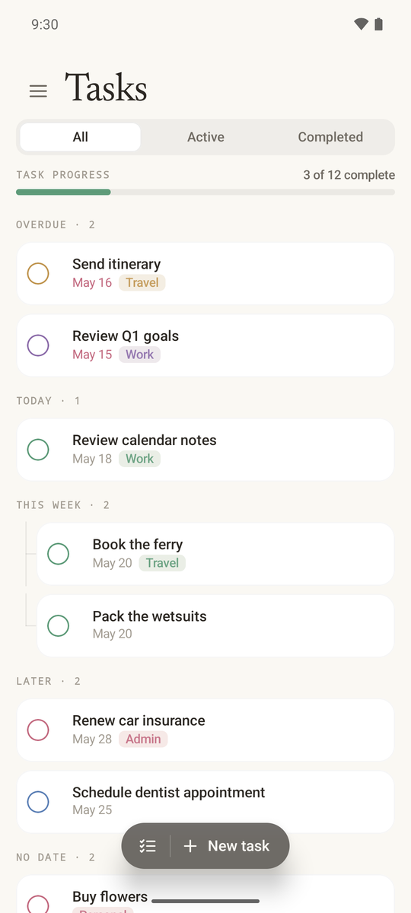
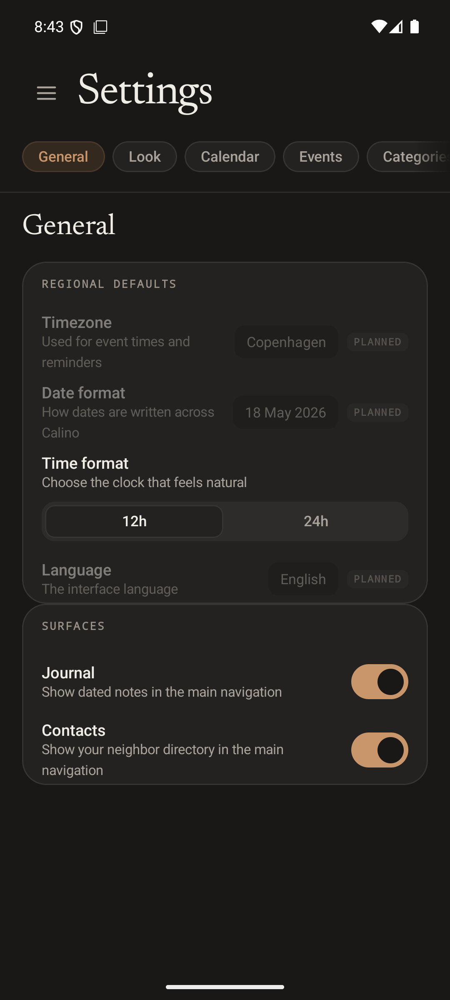
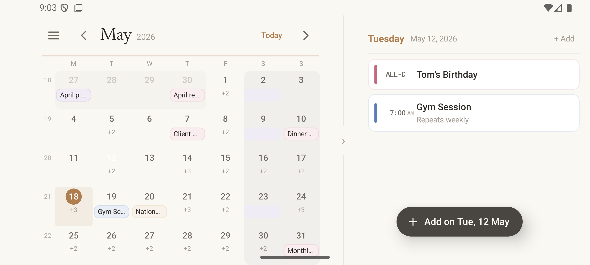
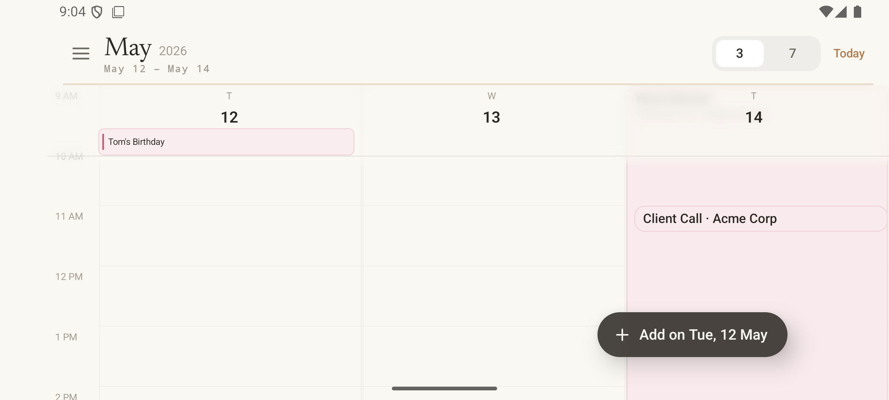
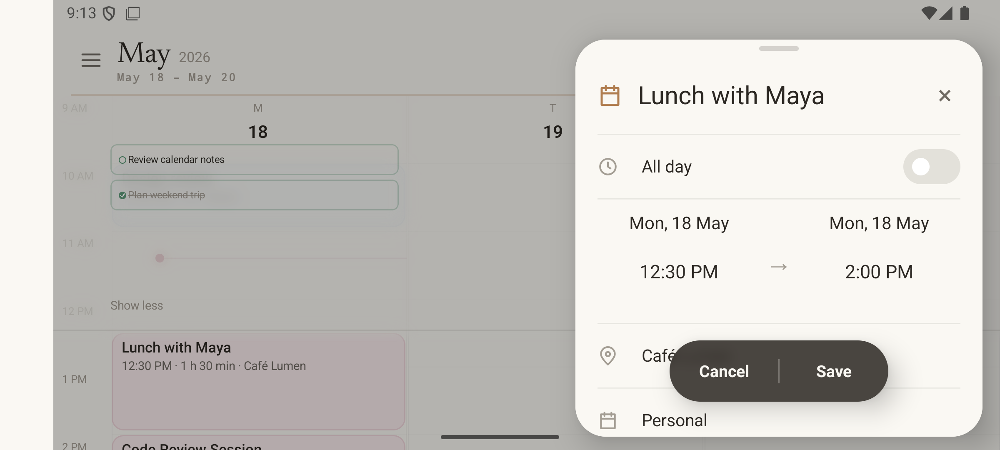
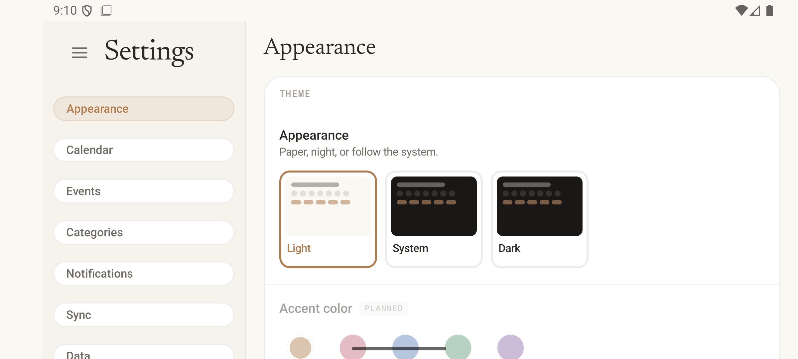

# Calino Android

Calino Android is a standalone Kotlin/Jetpack Compose sister project to the
[Calino web app](https://github.com/ivan-malinovski/calino). It is a native
Android project, with no WebView or Capacitor dependency.

This repository is mostly a place to explore the Android version of Calino in
the open. It is still a work in progress, but the app can connect to CalDAV
and CardDAV servers and also works with a built-in fixture when no account is
connected.

## What’s here

- Release APK/application ID: `calino.malinov.ski`
- Debug APK/application ID: `calino.malinov.ski.nativeDebug` (installable beside release)
- App label: `Calino`
- With no account connected, the app uses a frozen May 2026 fixture. A
  connected account uses CalDAV/CardDAV for events, tasks, journal entries,
  and contacts.
- Adaptive layouts cover compact phones, medium and expanded tablet windows,
  and landscape split panes. Foldable posture and hinge awareness is
  preliminary, including a keep-out band and an early tabletop/book layout.
- Home-screen widgets include resizable agenda, cards, and tasks variants.
  They read cached account data, update as the repository syncs, and link back
  into the app.
- Offline or retryable writes stay in a durable queue. Recurring event edits
  and deletes support THIS, FUTURE, and ALL scopes.
- Reminders are delivered locally through `AlarmManager`.
- AI Photo Import is opt-in and uses a bring-your-own API key. Images go
  directly to the provider and model selected by the user; no provider key is
  bundled here.

## Screenshots

The screenshots below use the built-in May 2026 fixture and contain no account
data. The second group is from the API 36 emulator in the landscape tablet
layout and light mode.

<table>
  <tr>
    <td></td>
    <td></td>
  </tr>
  <tr>
    <td></td>
    <td></td>
  </tr>
</table>

<table>
  <tr>
    <td></td>
    <td></td>
  </tr>
  <tr>
    <td></td>
    <td></td>
  </tr>
</table>

## If a reminder never arrives

Calino schedules reminders with an exact alarm, but several manufacturers --
Samsung, Xiaomi, Huawei, OnePlus and others -- shut background apps down
aggressively to save battery, and an app that has been shut down does not get
its alarm. If reminders stop arriving, exempt Calino from battery
optimisation; <https://dontkillmyapp.com> has the exact steps per manufacturer.

Two other things can hold a reminder back, and both are reported on the
Notifications screen inside the app:

- Android's notification permission has not been granted, so nothing is shown.
- Exact alarms are not permitted, so delivery falls back to an inexact alarm
  and can be up to about fifteen minutes late, and later during Doze.

## Build and install

From the repository root:

```bash
./gradlew assembleDebug
adb -s emulator-5554 install -r app/build/outputs/apk/debug/app-debug.apk
```

The generated debug APK is `app/build/outputs/apk/debug/app-debug.apk` and is
labelled **Calino Debug**. Release remains `calino.malinov.ski`; debug is
`calino.malinov.ski.nativeDebug`, so both can be installed at once. Release signing
is not configured yet, so `assembleRelease` produces an unsigned release APK
until a release key is added.

The app is routinely validated on the `calino-poc-api36` API 36 emulator for
build, unit tests, install/launch, and accessibility hierarchy. Live CalDAV and
CardDAV write probes are opt-in and use only environment-provided credentials.

## Emulator

Start the documented API 36 emulator with:

```bash
emulator -avd calino-poc-api36
```

Then install with the `adb` command above (use the emulator's serial from
`adb devices` if it is not `emulator-5554`).

The unit tests cover the frozen fixture/date contract, formatting and
recurrence behavior, zoom rest-state/selected-date continuity, and task bucket
rules. Run them with:

```bash
./gradlew test
```
