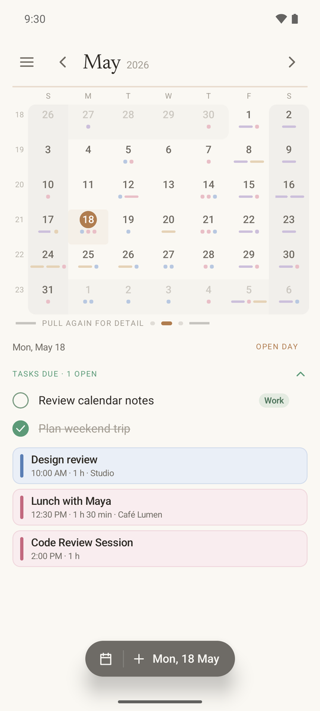
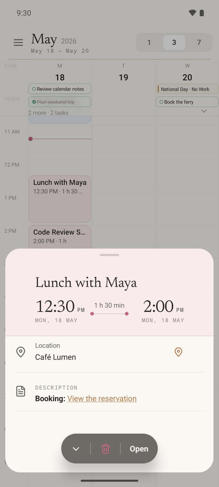
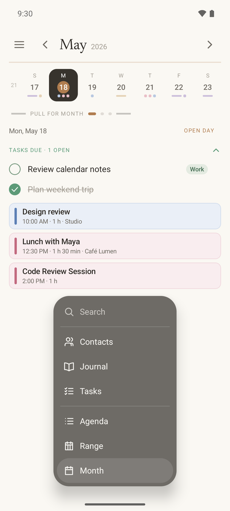
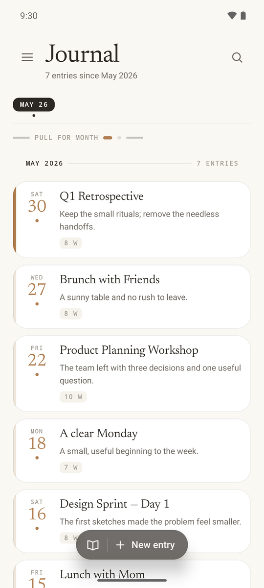
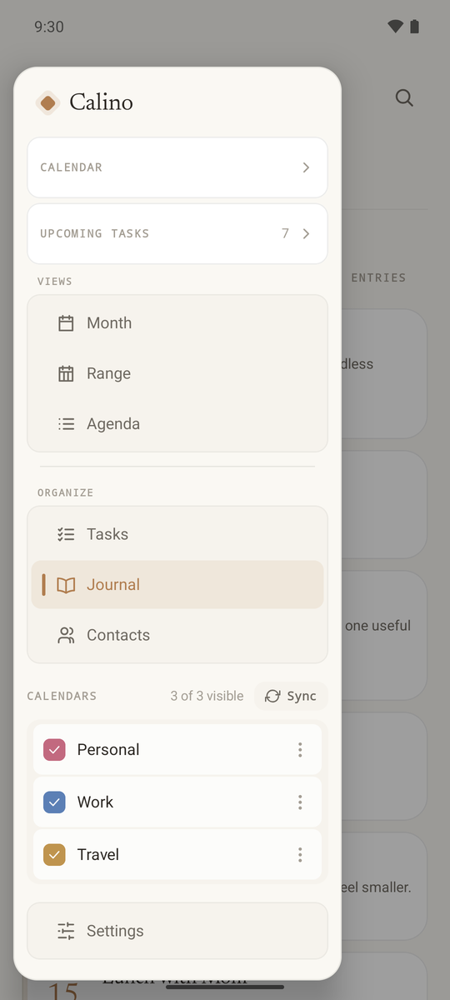

# Calino for Android

**A calm, native Android calendar for your own CalDAV and CardDAV server.**

Calino connects straight to the calendar and contacts server you already use, with no Calino account, hosted backend or telemetry in between. Events, tasks, journals and contacts live on your server; Calino keeps a local cache so it stays fast and works offline, and queues your edits until the connection is back.

It is written in Kotlin and Jetpack Compose and is the Android sister project to the [Calino web app](https://github.com/ivan-malinovski/calino). It is under active development. A built-in sample calendar lets you explore everything before connecting a server.

<table>
  <tr>
    <td></td>
    <td></td>
    <td></td>
    <td></td>
  </tr>
  <tr>
    <td></td>
    <td></td>
    <td></td>
    <td></td>
  </tr>
</table>

<sub>Screenshots use the built-in May 2026 sample data on the API 36 emulator; no real account data.</sub>

## Highlights

- **One calendar that zooms.** Pull the week strip down into a month, pull again for detail, or switch between agenda, 1/3/7-day range and month views. Paging and zoom follow your finger.
- **Events, tasks and journals.** Recurrence (with this / this-and-following / all edits), reminders, attendees, categories, travel time, priorities and completion, all stored as standard iCalendar.
- **Contacts** through CardDAV, including birthday and anniversary reminders.
- **Reminders that arrive**: exact alarms with event and task actions, and a clear explanation in-app when Android is holding them back.
- **Home-screen widgets** for agenda, calendar card and tasks, backed by the same cache as the app.
- **Fits into Android**: calendar intents, `.ics` import and sharing, map links, launcher shortcuts, optional device-calendar import, and opt-in phone search and assistant access (both off by default, and they never write without you).
- **Phones, tablets, landscape and foldables**, with split-pane layouts on large screens.
- **Optional AI Photo Import**: turn a photo of a poster or ticket into an event using the provider and key you choose. Nothing is sent unless you use it.
- **Experimental Wear OS companion** with agenda, tasks, a Tile and a complication, synced locally from the phone.

## Privacy and how it works

- Talks only to your CalDAV/CardDAV server. No telemetry, no Calino cloud.
- Passwords are kept in Android Keystore and never enter the cache or logs.
- Edits use ETags and conditional requests. If the server copy changed, Calino rebases just the fields you edited and keeps every property it does not understand, so other clients' data is not flattened.
- Offline edits wait in a durable queue and sync when the connection returns.
- Once a day, when opened, Calino may ask its GitHub Releases page whether a newer stable version exists. No calendar or account data is sent.

## Install

Download `app-release.apk` from the [latest release](https://github.com/ivan-malinovski/calino-android/releases/latest) and install it on your phone.

## Wear OS companion

Calino has an experimental watch app that shows your agenda and tasks on a Wear OS watch. It gets its data only from the phone app, over the connection between your phone and watch. The watch never connects to your server and never stores your password. The phone stays in charge: reminders still come from the phone. From the watch you can mark a task done or push it to tomorrow, and you can add Calino as a Tile or as a complication on your watch face that counts down to your next event.

The watch app is not on Google Play. Download `calino-wear-release.apk` from the same release and sideload it with ADB:

```bash
adb -s <watch-serial> install -r calino-wear-release.apk
```

## If a reminder never arrives

Calino schedules reminders with an exact alarm, but several manufacturers -- Samsung, Xiaomi, Huawei, OnePlus and others -- shut background apps down aggressively to save battery, and an app that has been shut down does not get its alarm. If reminders stop arriving, exempt Calino from battery optimisation; <https://dontkillmyapp.com> has the exact steps per manufacturer.

Two other things can hold a reminder back, and both are reported on the Notifications screen inside the app:

- Android's notification permission has not been granted, so nothing is shown.
- Exact alarms are not permitted, so delivery falls back to an inexact alarm and can be up to about fifteen minutes late, and later during Doze.

## Building from source

Requires JDK 17+ and the Android SDK. From the repository root:

```bash
./gradlew assembleDebug   # phone app, app/build/outputs/apk/debug/app-debug.apk
./gradlew :wear:assembleDebug   # Wear OS companion
./gradlew test            # unit tests
```

The debug build installs as **Calino Debug** (`calino.malinov.ski.nativeDebug`), so you can install it next to the release app (`calino.malinov.ski`). An unsigned release APK comes from `./gradlew assembleRelease`.
